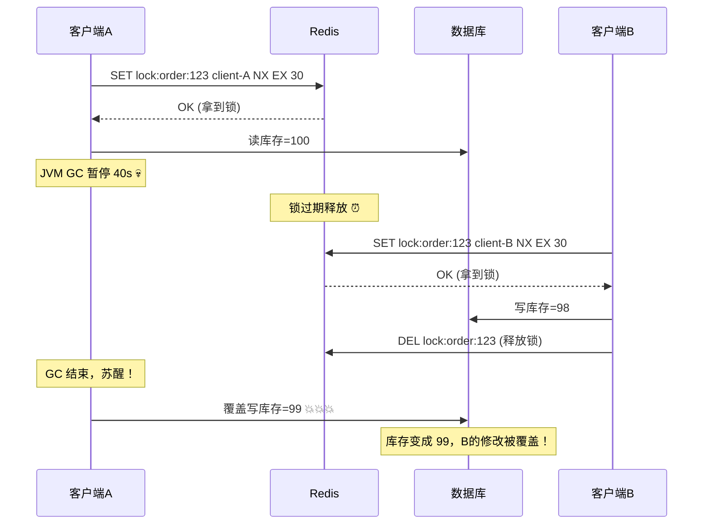
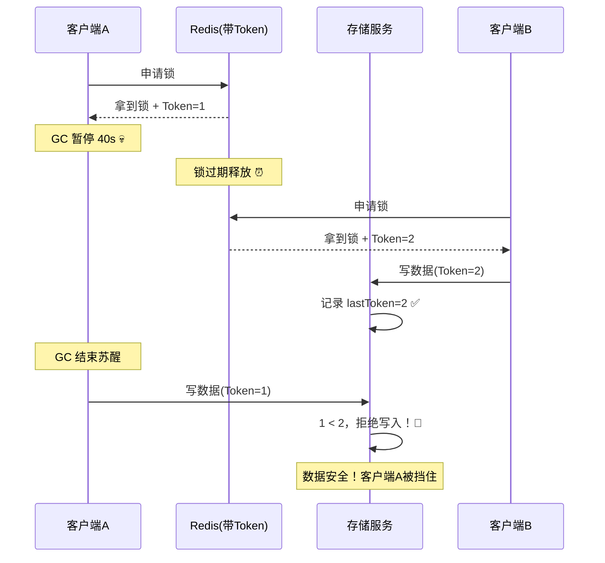

不知道朋友们在用 Redis 做分布式锁的时候有没有想过一个问题：**锁过期了怎么办？**

咱就是说，假设你拿到了锁，然后你的程序突然抽了一下风——可能是 GC 暂停了，可能是网络抖了一下，也可能是你写的那个破循环跑了太久……总之，当你苏醒过来的时候，你的锁早就过期了，另一个哥们已经拿到了同一把锁，开始欢快地写数据了。

而你的代码还不知道这一切，继续拿着"过期作废"的锁去写数据，直接把人家辛辛苦苦写的数据给覆盖掉了。

这，就是分布式锁最经典的 **"僵尸客户端"（Zombie Client）问题**。

今天我们就来聊聊 Redis 是怎么用一个叫 **Fencing Token** 的超简单机制，优雅地解决这个问题的～


---




## 场景重现：一个悲伤的故事

先给大家还原一下案发现场，让你直观感受一下没有 Fencing Token 的时候，事情会有多糟糕。

### 第一步：客户端 A 喜提锁

客户端 A 跟 Redis 说："没人用的话我就拿了啊！"，Redis 一瞅，这锁还空着呢，痛快地给了。

```bash
# 客户端 A 拿到锁，TTL 30 秒
SET lock:order:123 client-A NX EX 30
```

客户端 A 拿到锁之后开始操作共享存储（比如数据库），打算把库存从 100 改成 99。

### 第二步：客户端 A 掉线了

好巧不巧，就在客户端 A 刚改了一半的时候，JVM 来了一波 **Stop-The-World GC**，直接暂停了 40 秒。

等 GC 结束，客户端 A 苏醒过来的时候，大哥，30 秒早过了，Redis 那边的锁已经过期自动释放了。

### 第三步：客户端 B 接手

客户端 B 一看锁没了，立马上去："没人用？那我上了！"

```bash
# 客户端 B 拿到同一把锁
SET lock:order:123 client-B NX EX 30
```

客户端 B 拿到锁后，把库存从 99 改成了 98，然后心满意足地释放了锁。

### 第四步：悲剧发生

现在问题来了——**客户端 A 还不知道自己的锁过期了呀！**

它从 GC 暂停中醒来，心想："我应该还在持锁，接着干活"，然后把缓冲区里的旧数据（库存 99）写入数据库。

好家伙，这一写不要紧，直接把客户端 B 改的 98 又覆盖回 99 了。库存从 100 变 99 又变 98，最后又变回 99 —— 这库存管理怕不是在玩儿轮盘赌 😅



痛，太痛了。

---

## 主角登场：Fencing Token 是什么玩意儿

先说个通俗的比喻：

**去银行办业务，你会先取号对吧？** 叫号系统给你一个号码（比如"A003"），轮到你了才能去柜台。如果你中途跑去上了个厕所回来，发现你的号已经过号了，窗口已经在服务 A004 了，这时候你拿着 A003 的号码条上去，柜员会理你吗？不会！

**Fencing Token 就是这样一个"号码牌"机制。**

换成技术话来说：Redis 每次给客户端发锁的时候，顺便给你一个**单调递增的数字**作为 Token。你去写数据的时候，存储服务会检查你的 Token："你这个 Token 比我最近见过的还大吗？不大？那不好意思，驳回！"



看明白了吧？客户端 A 的 Token=1，客户端 B 的 Token=2。当客户端 A 拿着过期的 Token=1 去写的时候，存储服务微微一笑："您这个号已经过号了，下一个～"

---

## 亲手搓一个带 Fencing Token 的分布式锁

好了，理论整明白了，咱们来整点实在的。这里用 Java + Redis 来搓一个带 Fencing Token 的锁。

### 准备工作

首先，Redis 这边的锁存储就不能只存一个"谁持有"了，还得存个 Token 值。我们可以在 Redis Value 里塞个 JSON，或者直接用两个 Key。这里我们用简单的方式 —— **锁的 Value 直接存 Token**。

```java
import redis.clients.jedis.Jedis;
import java.util.UUID;

public class RedisLockWithFencingToken {

    private final Jedis jedis;
    private static final String LOCK_PREFIX = "lock:";
    private static final String TOKEN_PREFIX = "fencing_token:";

    public RedisLockWithFencingToken(Jedis jedis) {
        this.jedis = jedis;
    }

    /**
     * 尝试获取锁，成功返回 fencing token，失败返回 -1
     */
    public long tryLock(String lockKey, int expireSeconds) {
        // 原子操作：先递增 token，再拿这个 token 去抢锁
        String tokenKey = TOKEN_PREFIX + lockKey;
        long currentToken = jedis.incr(tokenKey); // INCR 返回递增后的值

        String fullLockKey = LOCK_PREFIX + lockKey;
        // SET NX EX：只有 key 不存在时才设置成功
        String result = jedis.set(
            fullLockKey,
            String.valueOf(currentToken),
            "NX", "EX", expireSeconds
        );

        if ("OK".equals(result)) {
            System.out.println("✅ 拿到锁，Token=" + currentToken);
            return currentToken;
        } else {
            System.out.println("❌ 锁被别人占着");
            return -1;
        }
    }

    /**
     * 释放锁，用 Lua 脚本保证原子性
     */
    public void unlock(String lockKey, long token) {
        String fullLockKey = LOCK_PREFIX + lockKey;
        String luaScript =
            "if redis.call('get', KEYS[1]) == ARGV[1] then " +
            "    return redis.call('del', KEYS[1]) " +
            "else " +
            "    return 0 " +
            "end";

        jedis.eval(luaScript,
            java.util.Collections.singletonList(fullLockKey),
            java.util.Collections.singletonList(String.valueOf(token))
        );
        System.out.println("🔓 释放锁，Token=" + token);
    }
}
```

**停一下，有个细节需要注意！** 上面代码里的 `incr(tokenKey)` 和 `set(lockKey)` **不是原子的** —— 这是两步操作。在极端并发场景下可能会有问题。但对于绝大多数业务场景来说，这两个操作的时间窗口极小，影响可以忽略。

> 如果大佬们追求极致的正确性，可以用 Lua 脚本把 incr + set NX 打包成一个原子操作。这里为了代码可读性，俺就不展开了～

### 加锁——用 Lua 确保原子性（追求极致版）

下面给追求完美的大佬们整一个 Lua 脚本版：

```java
/**
 * 原子操作版：incr token + set lock 一条龙
 */
public long tryLockAtomic(String lockKey, int expireSeconds) {
    String fullLockKey = LOCK_PREFIX + lockKey;
    String tokenKey = TOKEN_PREFIX + lockKey;

    String luaScript =
        "local token = redis.call('incr', KEYS[2]) " +   // 先递增 token
        "local result = redis.call('set', KEYS[1], token, 'NX', 'EX', ARGV[1]) " +
        "if result then " +
        "    return token " +  // 拿到锁，返回 token
        "else " +
        "    return -1 " +     // 没拿到
        "end";

    Object result = jedis.eval(luaScript,
        java.util.Arrays.asList(fullLockKey, tokenKey),
        java.util.Collections.singletonList(String.valueOf(expireSeconds))
    );

    long token = (Long) result;
    if (token > 0) {
        System.out.println("✅ 原子操作拿到锁，Token=" + token);
    }
    return token;
}
```

**这里有一个比较鸡贼的细节**：我们用的是 `INCR` 而不是随机生成 Token。`INCR` 天然保证单调递增，就算有 100 个客户端同时抢锁，Redis 单线程模型也能保证每个客户端拿到的 Token 是严格递增的，不会有重复。这比客户端自己生成 UUID 然后排序要靠谱得多～

---

## 存储端：只认最新的 Token

锁这边整完了，关键还得看**存储服务**怎么配合。光锁有 Token 没用，写数据的那边也得"认"这个 Token 才行。

来个简单的存储服务模拟：

```java
import java.util.concurrent.ConcurrentHashMap;
import java.util.concurrent.atomic.AtomicLong;

public class FencingStorageService {

    // 记录每个资源见过的最大 Token
    private final ConcurrentHashMap<String, AtomicLong> lastTokenMap = new ConcurrentHashMap<>();
    // 模拟存储（实际中这里是数据库或文件系统等）
    private final ConcurrentHashMap<String, String> storage = new ConcurrentHashMap<>();

    /**
     * 带 fencing token 校验的写操作
     * @return true=写入成功, false=被 fencing 拒绝
     */
    public boolean write(String resourceKey, String value, long token) {
        AtomicLong lastToken = lastTokenMap.computeIfAbsent(
            resourceKey, k -> new AtomicLong(0)
        );

        // CAS 更新最大 token
        long currentMax;
        do {
            currentMax = lastToken.get();
            if (token <= currentMax) {
                System.out.println("🚫 [资源:" + resourceKey + "] Token=" + token
                    + " <= 已见最大Token=" + currentMax + "，拒绝写入！");
                return false;
            }
        } while (!lastToken.compareAndSet(currentMax, token));

        // 执行实际写入
        storage.put(resourceKey, value);
        System.out.println("✅ [资源:" + resourceKey + "] Token=" + token
            + " 写入成功！value=" + value);
        return true;
    }
}
```

这个存储服务的逻辑贼清晰：**每次写入前，先看你带的 Token 是不是比我见过的最大的还要大。不是？滚犊子！**

### 完整业务流程串联

来来来，咱们把锁、Token、存储串起来跑一遍：

```java
public class FencingTokenDemo {

    public static void main(String[] args) {
        Jedis jedis = new Jedis("localhost", 6379);
        RedisLockWithFencingToken locker = new RedisLockWithFencingToken(jedis);
        FencingStorageService storage = new FencingStorageService();

        String lockKey = "order:123";

        // --- 客户端 A ---
        long tokenA = locker.tryLock(lockKey, 30);
        if (tokenA > 0) {
            // 拿到锁 + Token=1
            System.out.println("客户端A：拿到锁，Token=" + tokenA);

            // 模拟业务操作中...
            sleepSeconds(2);

            // 写数据
            storage.write(lockKey, "库存=99", tokenA);

            // 释放锁
            locker.unlock(lockKey, tokenA);
        }

        // --- 模拟 GC 暂停场景中客户端 A 拿着旧 Token 写数据 ---
        // 假设客户端 A 的锁过期了，客户端 B 已经拿到 Token=2 并写过了
        System.out.println("\n--- 场景：客户端A用过期Token写入 ---");
        storage.write(lockKey, "库存=98", 1); // Token=1, 但 lastToken 已经是2了
        // 输出：🚫 Token=1 <= 已见最大Token=2，拒绝写入！
    }

    private static void sleepSeconds(int sec) {
        try { Thread.sleep(sec * 1000L); }
        catch (InterruptedException e) { Thread.currentThread().interrupt(); }
    }
}
```

---

## Fencing Token 在真实世界的应用场景

唠完原理和代码，咱来看看这东西实际在哪用得上。说实话，Fencing Token 不是某个框架的专利，它更像是一种**设计思想**，用在哪里都香。

### 场景一：分布式锁 + 共享存储（经典场景）

这是最最经典的应用场景，也是咱们前面一直在聊的。

比如你的电商系统在做秒杀扣库存，多个服务实例竞争同一把 Redis 锁。一旦网络抖动导致某个实例的锁过期了，Fencing Token 就能保证它不会"诈尸"回来把库存写坏。

**适用条件**：你的存储层需要支持"检查 Token"这个操作。大多数情况下，数据库可以用 **CAS（Compare-And-Swap）+ 版本号** 来充当 Fencing Token 的角色：

```sql
-- 乐观锁版的 Fencing Token
UPDATE inventory
SET stock = stock - 1, version = version + 1
WHERE product_id = 123 AND version = #{myToken}
-- 如果 affected rows = 0，说明你的 Token 过期了，有人已经改过了
```

### 场景二：分布式任务调度

假如你有个定时任务，需要保证同一时刻只有一个实例在跑。你用 Redis 锁来协调：

- 实例 A 抢到锁（Token=5），开始执行数据迁移
- 实例 A 因为处理数据太慢，锁超时自动释放
- 实例 B 抢到锁（Token=6），开始执行同一份数据的迁移
- 实例 A 终于跑完了，准备写结果

如果没有 Fencing Token，实例 A 的旧结果就会覆盖实例 B 的新结果。有了 Token，实例 A 写的任何东西都会被拒绝，因为 5 < 6。

### 场景三：Leader 选举

在使用 Redis 做 Leader 选举的场景中，Fencing Token 可以防止一个已经被"废黜"的旧 Leader 继续执行写操作。

```java
// 每次选举出新 Leader，incr 一个 epoch 号（就是 Fencing Token）
long epoch = jedis.incr("cluster:epoch");
// 所有写操作都带上 epoch，Followers 只接受 epoch >= 当前 epoch 的请求
```

### 场景四：消息队列的消费者去重

比如你用 Redis List 或 Stream 做消息队列（嘿嘿，我的 Redis 消息队列文章里提到过哦），多个消费者抢消息。如果一个消费者处理到一半卡住了，消息超时重分配给另一个消费者。第一个消费者恢复后想把"旧的"处理结果写回，Fencing Token 就能帮它识别出"你这个结果已经过期了"。

---

## Fencing Token vs 其他方案

可能会有朋友问：**"我不搞 Fencing Token，我就把锁的过期时间设长一点不就行了？"**

嗯……这个思路吧，方向不太对。

你把锁过期时间改得再长，也防不住 GC 暂停啊。更坑的是，锁过期时间长意味着一旦你的服务真的挂掉了，下一个实例要等半天才能抢到锁——锁的可用性直接崩了。

还有人会问：**"我直接用 Redisson 的 WatchDog 自动续期机制不行吗？"**

Redisson 的 WatchDog（看门狗机制）确实能防止持有锁的过程中过期，但它防不了**主动续期失败**的情况。如果你的客户端 Full GC 了，WatchDog 线程也一起被暂停了，续期续不上去，锁照样过期。

所以严格意义上说，**WatchDog 和 Fencing Token 是互补关系，不是替代关系**：
- WatchDog 帮你**减少**锁意外过期的概率
- Fencing Token 在你锁已经过期后**兜底**，防止产生数据错乱

---

## 一个容易被忽略的细节

**Fencing Token 需要存储层配合**，这是很多朋友容易忽略的点。

如果你的存储层完全不支持 Token 校验（比如直接操作裸文件系统），那 Fencing Token 就英雄无用武之地了。这时候你得想别的办法，比如：

- 在应用层做校验（引入一个中间层去检查 Token）
- 或者干脆换个方案，比如用 Zookeeper 的临时顺序节点（天然带 fencing 效果）

所以说嘛，技术选型这事没有银弹——得看你的实际场景。Fencing Token 好用，但也有它的边界。

---

## 总结

回顾一下咱们今天聊的：

1. **分布式锁的问题**：锁过期后，旧客户端可能会"诈尸"写脏数据
2. **Fencing Token 的核心思路**：让锁服务返回一个递增的 Token，存储端只接受"最新"的 Token
3. **实现方式**：用 Redis 的 `INCR` 天然保证单调递增，Lua 脚本保证原子性
4. **应用场景**：分布式锁 + 共享存储、任务调度、Leader 选举、消息去重……

Fencing Token 的设计确实很巧妙——它没有在"怎么让锁不过期"这件事上死磕，而是换了个角度：**"锁该过期就过期，但我有办法防止旧数据写进来"**。这种思路转换才是它真正牛逼的地方。

以上是个人的一些经验分享，如果有哪里写的不对或者有什么更好的方案，也请大佬们在评论区指出来～

本文完结撒花！！！🎉✨

---

*相关阅读：*
- [Redis分布式锁的各种实现方式以及原理](/blog/posts/redis-distributed-lock/)
- [Redis分布式锁-vs-Zookeeper分布式锁-vs-数据库乐观锁](/blog/posts/distributed-lock-comparison/)
- [随机TTL防抖(Redis实现)](./随机TTL防抖(Redis实现).md)
